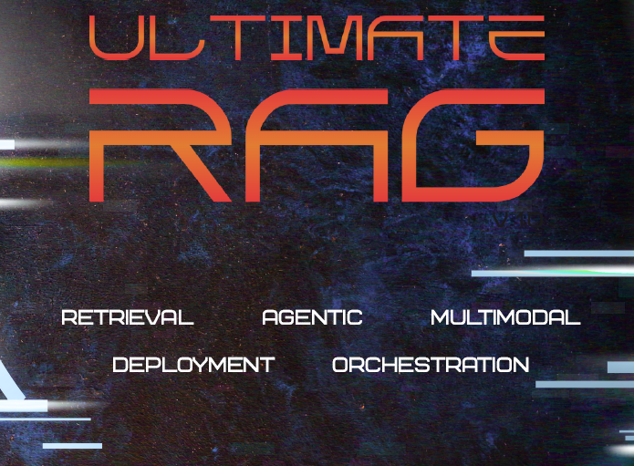

 <br>
---

Ultimate RAG Course
---
Designed for AI engineers, ML practitioners, and software developers, this course transforms RAG theory into production-grade implementations. Whether you're new to retrieval systems or experienced with LLMs, you'll gain expertise in Building scalable RAG pipelines (from basic
similarity search to knowledge graph-enhanced retrieval), Implementing enterprise features (hybrid search, MCP integration, self-improving agents), Deploying optimized systems (Docker, FastAPI, Kubernetes, AWS EKS), Solving real-world challenges (multimodal processing,
conversational memory, code-aware RAG). Through hands-on projects, you'll create portfolio-worthy systems including MCP-integrated code assistants and cloud-deployed multimodal RAG, all with professional monitoring and evaluation frameworks. <br>

Learning Objectives <br>
---
✅ Implement End-to-End RAG: From document ingestion (Unstructured.io, LlamaParse) to response synthesis (GPT-5, Claude 3.5) <br>
✅ Self-RAG with confidence scoring <br>
✅ Graph RAG with entity resolution <br>
✅ Model Context Protocol (MCP) integration <br>
✅ Optimize Production Systems <br>
✅ Kubernetes orchestration (EKS) <br>
✅ Advanced caching/load balancing <br>
✅ CI/CD with GitHub Actions/AWS CodePipeline <br>
✅ Build Specialized Applications <br>
✅ Multimodal RAG (CLIP + Whisper) <br>
✅ Smart code review with MCP servers <br>
✅ Agentic workflows with ReAct <br>

All Classes
---
02 Nov Day - 1 Induction Session <br>
08 Nov Day - 2 Tools And Installation <br>
09 Nov Day - 3 Introduction To RAG <br>
15 Nov Day - 4 RAG Architectures & Survey <br>
16 Nov Day - 5 Exploring Langchain For RAG <br>
## 22 Nov Day - 6 Exploring Langchain Part-1
### 📁 Notebook 02: Document Loaders
#### 🎯 Learning Objectives
By the end of this notebook, you will be able to:
1. Load documents from **PDF files** using PyPDFLoader
2. Load structured data from **CSV files**
3. Load JSON data from **API responses** or files
4. Scrape and load content from **web pages** (HTML)
5. Load **text files** and **markdown files**
6. **Batch process** multiple files using DirectoryLoader
7. Understand Document object structure
### 🦙 Local Offline RAG with Ollama
#### 🎯 Learning Objectives
This notebook demonstrates building a **completely offline RAG (Retrieval-Augmented Generation)** system using **Ollama** for local LLMs and embeddings.
#### 🚀 Benefits of Local RAG:
- **100% Offline**: No internet required after setup
- **Privacy First**: Your documents never leave your machine
- **No API Costs**: Free to run unlimited queries
- **Fast**: No network latency
- **Full Control**: Customize models and parameters
## 23 Nov Day - 7 Exploring Langchain Part-2
### ✂️ Notebook 03: Text Splitting Strategies
#### 🎯 Learning Objectives
1. Understand **why** text splitting is necessary for RAG
2. Master **RecursiveCharacterTextSplitter** (the recommended default)
3. Learn other splitters: Character, HTMLHeader, RecursiveJson, Token
4. Choose optimal **chunk sizes** and **overlap**
5. Compare splitters side-by-side
6. Apply the right splitter for different content types
### 🔢 Notebook 04: Embeddings and Vector Representations
#### 🎯 Learning Objectives
1. Understand what embeddings are
2. Use OpenAI Embeddings
3. Use Google Gemini Embeddings
4. Compare embedding models
5. Calculate similarity between vectors
### 🗄️ Notebook 05: Vector Stores
#### 🎯 Learning Objectives
1. Understand vector stores
2. Use InMemoryVectorStore (testing)
3. Use FAISS (production)
4. Use Chroma (persistent)
5. Compare vector stores
### 🔍 Notebook 06: Retrieval Strategies
#### 🎯 Learning Objectives
1. Create retrievers from vector stores
2. Use similarity search
3. Use MMR (diversity)
4. Custom retrievers with @chain
5. Compare strategies
### 🚀 Notebook 07: Complete RAG Pipeline
#### 🎯 Learning Objectives
1. Build a complete RAG application
2. Use LCEL to chain components
3. Create production-ready code
4. Handle errors properly
5. Implement best practices
### 08 - External Index Retrievers 🌐
#### 🎯 Learning Objectives
1. **What are External Index Retrievers** and how they differ from vector store retrievers
2. **ArxivRetriever** - Search and retrieve scholarly articles from arxiv.org
3. **WikipediaRetriever** - Access Wikipedia articles for general knowledge
4. **TavilySearchAPIRetriever** - Perform real-time internet searches
5. **Integration with RAG Chains** - Combine external retrievers with LLMs
6. **Best Practices** - When and how to use each retriever effectively

## 29 Nov Day - 8 Exploring Langchain Part-3
### Notebook 10: RAG Evaluation with Ragas Framework
#### 📚 What You'll Learn
This notebook covers the complete lifecycle of building and evaluating a production-quality RAG system:
1. ✅ **Basic RAG Pipeline** - Document loading, chunking, embeddings, retrieval, generation
2. ✅ **Building RAG Applications** - Prompt engineering, response formatting, handling edge cases
3. ✅ **Evaluation and Testing** - Comprehensive evaluation with Ragas framework

#### Why Evaluation Matters
Building a RAG system is only half the battle. Without proper evaluation, you can't:
- Know if your system is producing accurate answers
- Compare different configuration choices
- Identify areas for improvement
- Ensure production-ready quality

**This notebook introduces the Ragas evaluation framework** - the industry-standard tool for measuring RAG system performance.

#### 🎯 Learning Objectives
By the end of this notebook, you will:
- Understand the importance of RAG evaluation
- Implement a complete RAG pipeline from scratch
- Integrate the Ragas evaluation framework
- Create comprehensive test datasets with ground truth
- **Evaluate RAG systems across all 6 key non-multimodal metrics**
- Compare multiple RAG configurations systematically
- Visualize and interpret evaluation results
- Apply production best practices

### Vector Stores Tutorial: Qdrant & Weaviate
#### 🎯 Learning Objectives
In this tutorial, you'll learn:
- What vector stores are and why they're essential for RAG (Retrieval-Augmented Generation)
- How to work with **Qdrant** (local, in-memory, and persistent storage)
- How to work with **Weaviate** (Docker-based setup)
- How to use **Ollama embeddings** for real semantic search
- Metadata filtering with different vector store syntaxes
- When to use each vector store based on your use case

### 30 Nov Day - 9 Exploring Langchain Part-4 <br>

## Create the virtual environment in anaconda3 folder
```
conda create -n venv_ur_name python==3.12 -y
conda activate venv_ur_name
conda deactivate
```

## Delete the virtual environment using conda
```
conda remove -n venv_ur_name --all
```

## Create the virtual environment in current folder
```
conda create -p venv_ur_name python==3.12 -y
conda activate
conda deactivate
```

## Create a virtual environment in Python with Conda 
Refer 👉 https://gist.github.com/loic-nazaries/b18a908473935243fc23586f35d4bacc

Resources
---
[Ultimate RAG Course 👉 Software Checklist](https://krishnaikacademy.notion.site/Software-Checklist-2a5eba9593d08048927ed6fbd00f502d) <br>

[Ultimate RAG Course 👉 Class Notes & Additional Materials](https://krishnaikacademy.notion.site/Ultimate-RAG-Course-2a5eba9593d08085ade8ceb2a6c6c8de) <br>
