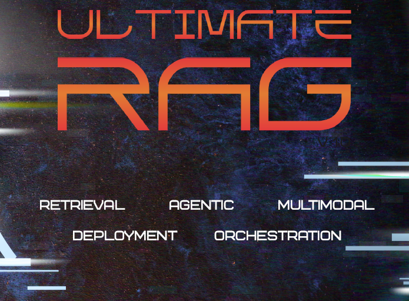

 <br>
---

Ultimate RAG Course
---
Designed for AI engineers, ML practitioners, and software developers, this course transforms RAG theory into production-grade implementations. Whether you're new to retrieval systems or experienced with LLMs, you'll gain expertise in Building scalable RAG pipelines (from basic
similarity search to knowledge graph-enhanced retrieval), Implementing enterprise features (hybrid search, MCP integration, self-improving agents), Deploying optimized systems (Docker, FastAPI, Kubernetes, AWS EKS), Solving real-world challenges (multimodal processing,
conversational memory, code-aware RAG). Through hands-on projects, you'll create portfolio-worthy systems including MCP-integrated code assistants and cloud-deployed multimodal RAG, all with professional monitoring and evaluation frameworks. <br>

Learning Objectives <br>
---
✅ Implement End-to-End RAG: From document ingestion (Unstructured.io, LlamaParse) to response synthesis (GPT-5, Claude 3.5) <br>
✅ Self-RAG with confidence scoring <br>
✅ Graph RAG with entity resolution <br>
✅ Model Context Protocol (MCP) integration <br>
✅ Optimize Production Systems <br>
✅ Kubernetes orchestration (EKS) <br>
✅ Advanced caching/load balancing <br>
✅ CI/CD with GitHub Actions/AWS CodePipeline <br>
✅ Build Specialized Applications <br>
✅ Multimodal RAG (CLIP + Whisper) <br>
✅ Smart code review with MCP servers <br>
✅ Agentic workflows with ReAct <br>

# 📚 Learning Topics Related to Ultimate RAG Course
This course is designed to provide students with a foundational, depth and practical understanding of RAG and Agents.
## 02 Nov Day - 1 👉 Induction Session <br>
### Induction Session Regarding Ultimate RAG Course
#### 🎯 Learning Objectives
- 📝 Agenda of Ultimate RAG course
- ⏱️ Timeline to complete the course
- 🎯 Objectives
- 📚 Learning Topics of Ultimate RAG course
- 💬 Q&A

## 08 Nov Day - 2 👉 Tools And Installation <br>
### General Software Checklist
#### 🎯 Learning Objectives
- [ ]  Python Distribution
- [ ]  IDE
- [ ]  GIT ——> GIT BASH
- [ ]  DOCKER
- [ ]  POSTMAN (Optional)
- [ ]  WARP (Optional)
- [ ]  AWS CLI
### Python Distributions(Any One)
- [ ] Anaconda (Majorly we will use in this course)
- [ ] Python
### Package Managers(Any One)
- [ ]  Conda (*Rarely*)
- [ ]  pip (*Majorly we will use in this course*)
- [ ]  uv (*Optional*)
### Local IDE or Text Editor(Any One)
- [ ]  VSCODE (*Majorly we will use in this course*)
- [ ]  CURSOR *PAID*
- [ ]  WINDSURF *PAID*
- [ ]  TRAE
- [ ]  PYCHARM Community or Professional
- [ ]  KIRO
### OPTIONAL : Browser based Online IDE
- [ ]  Lightning.ai
- [ ]  Replit
- [ ]  Firebase Studio
### Working with virtual environment
- [ ]  venv
- [ ]  conda
- [ ]  uv
### Version Control System
- [ ]  GIT (*Always we use in the course*)
- [ ]  Github Desktop (*Optional)*
### Extra Tools
- [ ] Markdown
    - Markdown Basics
- [ ] Docker
    - Docker Basics
- [ ] Cloud CLI
    - AWS CLI
    - GCP CLI
- [ ] API Tool
    - Postman
    - Warp Terminal

## 09 Nov Day - 3 👉 Introduction To RAG <br>
### 📚🔎🧠 Introduction to RAG
#### 🎯 Learning Objectives
- RAG: Retrieval-Augmented Generation for Knowledge-Intensive NLP
    - Core Innovation
    - How It Works
    - Key Results
    - Advantages
    - RAG Architecture
- Additional Study Materials
    - NLP Book → https://web.stanford.edu/~jurafsky/slp3/
    - Seq2Seq Model → https://jalammar.github.io/visualizing-neural-machine-translation-mechanics-of-seq2seq-models-with-attention/
    - Transformers → https://jalammar.github.io/illustrated-transformer/
    - Udemy NLP Course → https://www.udemy.com/course/complete-machine-learning-nlp-bootcamp-mlops-deployment/?couponCode=ACCAGE0923
    - Transformer Explainer → https://www.youtube.com/watch?v=csWluHwfsB8

#### `Explained This Research Paper in breif` 👉 https://arxiv.org/pdf/2005.11401

## 15 Nov Day - 4 👉 RAG Architectures & Survey <br>
### 📚🔎🧠 RAG Detailed Survey
#### Retrieval-Augmented Generation for Large Language Models: A Survey
#### 🎯 Learning Objectives
📚 By the end of this notebook, you will Learn:
- Key Contributions
    - Three RAG Paradigms
    -  Core Components Analysis
    - Comprehensive Evaluation Framework
- Key Insights
    - RAG Challenges
    - RAG vs. Fine-tuning
    - Future Directions
- Practical Value
- Research Papers
    1. Pre-training (Orange/Yellow Branch - Left)
    2. Fine-tuning (Green Branch - Center)
    3.  Inference (Dark Blue/Teal Branch - Right)
- Three RAG Paradigms
    1. Naive RAG (Left - Blue)
    2. Advanced RAG (Middle - Orange)
    3. Modular RAG (Right - Blue/Orange)
- Evolution Timeline
- Practical Examples
    - Naive RAG
    - Advanced RAG
    - Modular RAG
    - Iterative RAG
    - Recursive RAG
    - Adaptive RAG
- When to Use Each
    - Use Iterative when
    - Use Recursive when
    - Use Adaptive when

#### `Explained This Research Paper in breif` 👉 https://arxiv.org/pdf/2312.10997

## 16 Nov Day - 5 👉 Exploring Langchain For RAG <br>
### Exploring Langchain
#### 🎯 Learning Objectives
📚 By the end of this notebook, you will Learn:
- Updated Requirements.txt
- LLM Selection OPENAI or GEMINI
- Google Gemini Embeddings
- 🎯 Maximum Marginal Relevance (MMR)
    - How MMR Works
    - MMR vs Cosine Similarity
    - MMR would return
### 📋 All LangChain Vector Store Search Types
1. Similarity Search (Default)
1. MMR (Maximum Marginal Relevance)
1. Similarity Score Threshold
1. Metadata Filtering
### 📝Assignment
#### 🚀Building a Hybrid Retriever System
You are tasked with building a **Study Assistant** naive rag system that helps students learn about a technical topic (e.g., Machine Learning, Python Programming, or Data Science).

The challenge: Students often need both **specific course material** (lecture notes, textbook excerpts) and **general background knowledge** (definitions, historical context, broader concepts).

💿Dataset
- Build your own dataset with multiple file formats including PDFS, HTML, TXT Files.
- Create 5-7 sample documents on a topic of your choice

***Choose any embedding model, any LLM, or any vector database of your choice***

**Your solution should:**
- Use a vector store to search through local study materials
- Use an external retriever (Wikipedia) to provide general knowledge
- Combine both sources intelligently to give comprehensive answers

## 22 Nov Day - 6 👉 Exploring Langchain: Part-1
### 📁 Notebook 02: Document Loaders
#### 🎯 Learning Objectives
📚 By the end of this notebook, you will be able to:
1. Load documents from **PDF files** using PyPDFLoader
2. Load structured data from **CSV files**
3. Load JSON data from **API responses** or files
4. Scrape and load content from **web pages** (HTML)
5. Load **text files** and **markdown files**
6. **Batch process** multiple files using DirectoryLoader
7. Understand Document object structure
### 🦙 Local Offline RAG with Ollama
#### 🎯 Learning Objectives
📚 By the end of this notebook, you will Learn:
This notebook demonstrates building a **completely offline RAG (Retrieval-Augmented Generation)** system using **Ollama** for local LLMs and embeddings.
#### 🚀 Benefits of Local RAG:
- **100% Offline**: No internet required after setup
- **Privacy First**: Your documents never leave your machine
- **No API Costs**: Free to run unlimited queries
- **Fast**: No network latency
- **Full Control**: Customize models and parameters

## 23 Nov Day - 7 👉 Exploring Langchain: Part-2
### ✂️ Notebook 03: Text Splitting Strategies
#### 🎯 Learning Objectives
📚 By the end of this notebook, you will Learn:
1. Understand **why** text splitting is necessary for RAG
2. Master **RecursiveCharacterTextSplitter** (the recommended default)
3. Learn other splitters: Character, HTMLHeader, RecursiveJson, Token
4. Choose optimal **chunk sizes** and **overlap**
5. Compare splitters side-by-side
6. Apply the right splitter for different content types
### 🔢 Notebook 04: Embeddings and Vector Representations
#### 🎯 Learning Objectives
📚 By the end of this notebook, you will Learn:
1. Understand what embeddings are
2. Use OpenAI Embeddings
3. Use Google Gemini Embeddings
4. Compare embedding models
5. Calculate similarity between vectors
📚 By the end of this notebook, you will Learn:
### 🗄️ Notebook 05: Vector Stores
#### 🎯 Learning Objectives
📚 By the end of this notebook, you will Learn:
1. Understand vector stores
2. Use InMemoryVectorStore (testing)
3. Use FAISS (production)
4. Use Chroma (persistent)
5. Compare vector stores
### 🔍 Notebook 06: Retrieval Strategies
#### 🎯 Learning Objectives
📚 By the end of this notebook, you will Learn:
1. Create retrievers from vector stores
2. Use similarity search
3. Use MMR (diversity)
4. Custom retrievers with @chain
5. Compare strategies
### 🚀 Notebook 07: Complete RAG Pipeline
#### 🎯 Learning Objectives
📚 By the end of this notebook, you will Learn:
1. Build a complete RAG application
2. Use LCEL to chain components
3. Create production-ready code
4. Handle errors properly
5. Implement best practices
### 08 - External Index Retrievers 🌐
#### 🎯 Learning Objectives
📚 By the end of this notebook, you will Learn:
1. **What are External Index Retrievers** and how they differ from vector store retrievers
2. **ArxivRetriever** - Search and retrieve scholarly articles from arxiv.org
3. **WikipediaRetriever** - Access Wikipedia articles for general knowledge
4. **TavilySearchAPIRetriever** - Perform real-time internet searches
5. **Integration with RAG Chains** - Combine external retrievers with LLMs
6. **Best Practices** - When and how to use each retriever effectively

## 29 Nov Day - 8 👉 Exploring Langchain: Part-3
### Vector Stores Tutorial: Qdrant & Weaviate
#### 🎯 Learning Objectives
📚 By the end of this notebook, you will Learn:
- What vector stores are and why they're essential for RAG (Retrieval-Augmented Generation)
- How to work with **Qdrant** (local, in-memory, and persistent storage)
- How to work with **Weaviate** (Docker-based setup)
- How to use **Ollama embeddings** for real semantic search
- Metadata filtering with different vector store syntaxes
- When to use each vector store based on your use case

### 📚 Notebook 10: RAG Evaluation with Ragas Framework
#### 🎯 Learning Objectives
📚 By the end of this notebook, you will Learn:
This notebook covers the complete lifecycle of building and evaluating a production-quality RAG system:
1. ✅ **Basic RAG Pipeline** - Document loading, chunking, embeddings, retrieval, generation
2. ✅ **Building RAG Applications** - Prompt engineering, response formatting, handling edge cases
3. ✅ **Evaluation and Testing** - Comprehensive evaluation with Ragas framework

#### Why Evaluation Matters
Building a RAG system is only half the battle. Without proper evaluation, you can't:
- Know if your system is producing accurate answers
- Compare different configuration choices
- Identify areas for improvement
- Ensure production-ready quality

**This notebook introduces the Ragas evaluation framework** - the industry-standard tool for measuring RAG system performance.

#### 🎯 Learning Objectives
📚 By the end of this notebook, you will Learn:
- Understand the importance of RAG evaluation
- Implement a complete RAG pipeline from scratch
- Integrate the Ragas evaluation framework
- Create comprehensive test datasets with ground truth
- **Evaluate RAG systems across all 6 key non-multimodal metrics**
- Compare multiple RAG configurations systematically
- Visualize and interpret evaluation results
- Apply production best practices

## 30 Nov Day - 9 Exploring Langchain Part-4 <br>
### 📊 Notebook 12: RAGAS Metrics Deep Dive
**Understanding How RAG Evaluation Metrics Work Internally**
#### 🎯 Learning Objectives
📚 By the end of this notebook, you will Learn:
1. **Understand the internal calculation process** for each of the 6 core RAGAS metrics
2. **See intermediate outputs** like extracted claims, generated questions, and identified entities
3. **Learn to interpret scores with confidence** using threshold guidelines
4. **Debug evaluation issues** by understanding what each metric actually measures

## 04 Dec Day - 10 👉 Exploring RAGAS and LLM as Judge
### 📚 Notebook 11: RAG Evaluation with LLM-as-Judge
**Module 3: RAG Evaluation Techniques**
#### 🎯 Learning Objectives
📚 By completing this notebook, you will Learn:
- Understand the **LLM-as-Judge evaluation methodology**
- Learn when to use LLM-as-Judge vs automated frameworks like Ragas
- Implement a **complete RAG pipeline** (same as Notebook 10)
- Design **structured evaluation prompts** with Pydantic models
- Evaluate RAG systems across **3 core metrics**:
  - 🎯 **Groundedness**: Is the answer faithful to retrieved context?
  - 🎯 **Answer Relevance**: Does the answer address the question?
  - 🎯 **Retrieval Quality**: Are the retrieved contexts relevant?
- Analyze results with **detailed reasoning** and visualizations
- Understand **cost and performance trade-offs**

## 06 Dec Day - 11 Document Parsers for RAG Part-1 
### 3.1 Document Parsing with Docling for RAG Systems
#### 🎯 Learning Objectives
📚 By completing this notebook, you will Learn:
1. **Basic Document Conversion** - Convert PDFs and other formats to Markdown, JSON, HTML
2. **Multiple File Formats** - PDF, DOCX, XLSX, PPTX, HTML, Markdown, Images, Audio
3. **Pipeline Configuration** - OCR engines, table extraction, layout analysis, VLM
4. **LangChain Integration** - DoclingLoader and RAG pipeline with Chroma
5. **Advanced Topics** - Enrichment, error handling

## 07 Dec Day - 12 Document Parsers for RAG Part-2 
### 3.2 Document Parsing with Unstructured for RAG Systems
#### 🎯 Learning Objectives
📚 By completing this notebook, you will Learn:
1. **Core Concepts**: Understanding partition functions, elements, and metadata
2. **Partitioning Strategies**: AUTO, FAST, HI_RES, and OCR_ONLY approaches
3. **File Format Support**: Working with PDFs, Office documents, HTML, Markdown, Images, and more
4. **LangChain Integration**: Seamless integration with LangChain for RAG pipelines
5. **Complete RAG Example**: End-to-end implementation with vector stores

## 13 Dec Day - 13 Document Parsers for RAG Part-3 
### 3.3 Document Parsing with LlamaParse for RAG Systems
#### 🎯 Learning Objectives
- Core Features & Parsing Fundamentals
LlamaParse is a document parsing service by LlamaIndex that excels at:
- **Complex Document Handling**: Financial reports, research papers, scanned PDFs
- **Precise Extraction**: Tables, charts, images, and diagrams
- **70+ File Formats**: PDF, DOCX, XLSX, PPTX, HTML, images, audio, and more
- **LLM-Ready Output**: Clean markdown, text, or structured JSON

#### Part 1 Contents
1. Introduction & Setup
2. Core Concepts
3. Basic Document Parsing
4. Presets & Built-in Configurations
5. Parse Modes (Fast, Premium, Auto)
6. Supported File Formats
7. Multimodal Parsing Features
8. Layout Extraction
9. Structured Output

**Part 2** covers: Custom Prompts, Advanced Configuration, Async Operations, LlamaIndex Integration, RAG Examples, CLI Usage, and Best Practices.

## 14 Dec Day - 14 👉 Poject-1: RAG Q&A System 
### 04 🤖 RAG Q&A System
#### 🎯 Learning Objectives
##### 📖 **Overview**
A **production-ready** RAG (Retrieval-Augmented Generation) system that enables intelligent Q&A over your documents. Built with modern AI stack and battle-tested in production environments.

##### 🎯 **What is RAG?**
RAG combines the power of **retrieval** (finding relevant information) with **generation** (creating coherent answers) to provide accurate, context-aware responses to your questions based on your own documents.

##### 🌟 **Key Highlights**
🚀 Production Ready: Docker + CI/CD + AWS deployment <br>
🧠 Smart AI: Powered by OpenAI GPT-4o & LangChain <br>
📊 Observable: LangSmith integration for full tracing <br>
✅ Evaluated: RAGAS metrics for answer quality <br>
🔒 Secure: Non-root Docker, API validation, error handling <br>
⚡ Fast: Async operations, streaming responses <br>
📈 Scalable: Cloud-native architecture <br>

##### ✨ **Features**
📄 **Document Management**
- ✅ Upload PDF, TXT, and CSV files
- ✅ Automatic text extraction and chunking
- ✅ Smart document splitting with overlap
- ✅ Vector storage in Qdrant Cloud

💬 **Intelligent Q&A**
- ✅ Natural language questions
- ✅ Context-aware answers
- ✅ Source attribution (see which docs were used)
- ✅ Streaming responses for real-time feedback
- ✅ Multiple query modes (standard, search-only)

🔍 **Observability & Quality**
- ✅ LangSmith Tracing: Full chain visibility, token tracking, cost analysis
- ✅ RAGAS Evaluation: Faithfulness & answer relevancy metrics
- ✅ Structured Logging: Comprehensive error tracking
- ✅ Health Checks: Readiness & liveness endpoints

🛠️ **Developer Experience**
- ✅ Auto-generated Swagger docs at /docs
- ✅ Type-safe Pydantic models
- ✅ Comprehensive tests with 70%+ coverage
- ✅ Hot reload in development
- ✅ CI/CD pipeline with GitHub Actions

## 18 Dec Day - 15 👉 Extra Class: Pydantic-FastAPI-Tutorials 
### 05-Pydantic-FastAPI-Tutorials
#### 🎯 Learning Objectives
- Data validation and type safety
- Creating models for complex data structures
- Custom validation logic
- Configuration management
- Building APIs with FastAPI
1. Introduction & Setup
- What is Pydantic? <br>
Pydantic is a data validation library that uses Python type annotations to:
   - ✅ Validate data automatically
   - ✅ Parse and convert data types
   - ✅ Provide clear error messages
   - ✅ Generate JSON schemas
   - ✅ Power frameworks like FastAPI
- Why Use Pydantic? <br>
- Quick Intro to Type Hints
- Installation
  - !uv pip install pydantic
2. Basic Models
3. Field Types & Validation
4. Nested Models & Complex Types
5. Custom Validators

## 20 Dec Day - 16 👉 Poject-1: AWS Deployment 
### 🤖 06-RAG-QA-Project
#### 🎯 Learning Objectives
- rag-project-class project deployment using CI/CD Pipeline with Github Actions
- CI/CD pipeline with GitHub Actions

## 21 Dec Day - 17 👉 Llama-Index-Tutorials: Part-1
### 🦙 07-Llama-Index-Tutorials
#### 🎯 Learning Objectives
#### 📚 Notebook 1: Setup & Basics
✅ Understand LlamaIndex architecture and modular ecosystem <br>
✅ Install and configure LlamaIndex with the latest modular packages <br>
✅ Configure the Settings object (LLM, embeddings, chunk size) <br>
✅ Create your first VectorStoreIndex from documents <br>
✅ Execute basic queries and analyze responses <br>
✅ Understand the Document → Node → Index flow <br>

#### 📚 Notebook 2: Documents & Chunking
✅ Load documents from multiple sources (local files, PDFs, web) <br>
✅ Implement different chunking strategies (sentence, token, semantic) <br>
✅ Add custom metadata at document and node levels <br>
✅ Create and manage node relationships <br>
✅ Optimize chunking for retrieval quality <br>
✅ Apply batch embedding optimization <br>

#### 📚 Notebook 3: Indexing & Simple Queries
✅ Integrate external vector stores (Qdrant, Chroma) <br>
✅ Compare embedding models (OpenAI vs HuggingFace) <br>
✅ Persist and load indexes from storage <br>
✅ Configure query engines with different modes <br>
✅ Implement VectorIndexRetriever and VectorIndexAutoRetriever <br>
✅ Understand response synthesis modes <br>
✅ Implement streaming responses <br>

## 03 Jan Day - 18 👉 Llama-Index: Part-2 & 🦛 Chonkie ✨
### 🦙 07-Llama-Index-Tutorials
#### 🎯 Learning Objectives
#### 📚 Notebook 4: Advanced Retrieval
✅ Implement RecursiveRetriever for hierarchical document retrieval  <br>
✅ Use QueryFusionRetriever to combine multiple retrieval strategies  <br>
✅ Build custom retrievers with specialized ranking logic  <br>
✅ Apply query transformation techniques (HyDE, rewriting, multi-query)  <br>
✅ Implement complex metadata filtering (AND/OR/NOT logic)  <br>
✅ Evaluate retrieval quality with metrics  <br>

#### 📚 Notebook 5: Hybrid Search & Reranking
✅ Understand dense vs sparse vectors and BM25 algorithm <br>
✅ Implement hybrid search combining semantic and keyword matching <br>
✅ Configure alpha parameter for optimal score fusion <br>
✅ Apply reranking models (Cohere, SentenceTransformer cross-encoders) <br>

#### 🔍 Evaluating the Ideal Chunk Size for a RAG System using LlamaIndex
- Introduction
- Why Chunk Size Matters
- Setting Up Evaluators
- Response Evaluation For A Chunk Size
- Testing Across Different Chunk Sizes

#### 🦛 Get Started with Chonkie
- 🦛 Chonkie  Documentation ✨
- Installation
- CHONK! 🦛✨

## 04 Jan Day - 19 👉 🦛 Chonkie ✨ Chonkie-Chunkers-Tutorials
### 🦛 08-Chonkie-Chunkers-Tutorials
#### 🎯 Learning Objectives
- **9 Different Chunking Strategies:** From basic token splitting to advanced LLM-powered chunking
- **Google Gemini Integration:** Using Gemini embeddings for semantic chunking
- **Practical Examples:** Real-world applications with technical docs and research papers
- **Performance Comparisons:** Side-by-side analysis of all chunkers
- **Best Practices:** How to choose the right chunker for your use case

#### Tutorial Structure
1. Introduction & Setup
1. Foundation Chunkers - Token, Sentence, Recursive
1. Specialized Chunkers - Table, Code
1. Semantic Chunkers - Semantic, Late, Neural
1. Advanced Chunker - Slumber (LLM-powered)
1. Comparative Analysis
1. Best Practices

## Create the virtual environment in anaconda3 folder
```
conda create -n venv_ur_name python==3.12 -y
conda activate venv_ur_name
conda deactivate
```

## Delete the virtual environment using conda
```
conda remove -n venv_ur_name --all
```

## Create the virtual environment in current folder
```
conda create -p venv_ur_name python==3.12 -y
conda activate
conda deactivate
```

## Create a virtual environment in Python with Conda 
Refer 👉 https://gist.github.com/loic-nazaries/b18a908473935243fc23586f35d4bacc

Resources
---
[Ultimate RAG Course 👉 Software Checklist](https://krishnaikacademy.notion.site/Software-Checklist-2a5eba9593d08048927ed6fbd00f502d) <br>

[Ultimate RAG Course 👉 Class Notes & Additional Materials](https://krishnaikacademy.notion.site/Ultimate-RAG-Course-2a5eba9593d08085ade8ceb2a6c6c8de) <br>

[Ultimate RAG Document Hub 👉 Class Notes](https://krishnaikacademy.notion.site/ultimateragcourse?v=2a5eba9593d080a885b6000c6a7b8358) <br>
